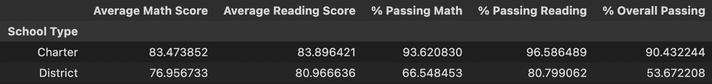
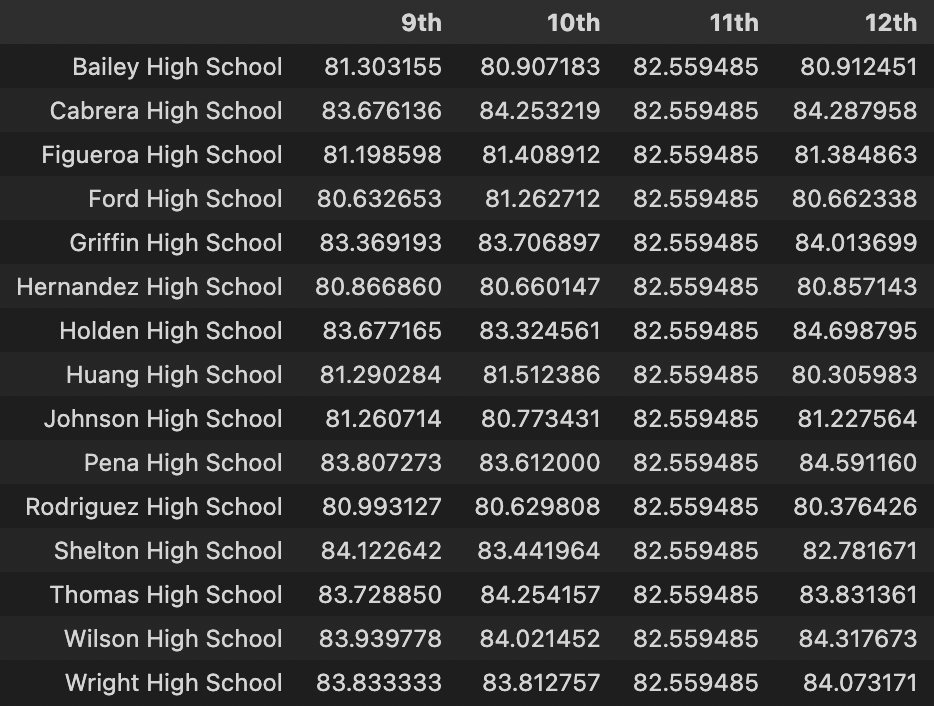

# Pandas-Challenge
## Module 4 Assignment

## Glen Dagger

***

For this assignment, I used the Pandas module to import, combine, and analyze data from two CSV files. I created multiple dataframe objects to create summaries for the district overall ("District Summary") and for the district broken down by each school ("Per School Summary"). I used my knowledge of creating dataframes, selecting columns, using boolean indexing and basic column operations, as well as using the merge, concat, groupby, and cut functions to create, clean, and analyze all dataframes (see below screenshots).

*District Summary*

 

*First 5 rows of Per School Summary*

 

***
## Written Report

After analyzing this data, I have drawn the following conclusions:

- In the Scores by School Spending section, I noticed that there seems to be a negative correlation between money spent per student and student success. In every single column, average scores and passing percentages decrease as the spending range increases. Further analysis is necessary to understand the differences in funding by school type and school size and how those differences affect per capita spending.

 

*Scores by School Spending Screenshot*

  

- In the Scores by School Size section, while there is not a noticeable difference on average test scores and passing percentages between small and medium schools, large schools show significant drops in the percent of students passing math (around 70% of students in large schools passed math while the percentage hovers around 93-94% of small/medium schools). This also impacts the percent of students who pass overall significantly. Interestingly, the average math scores do not show such a dramatic difference (78% for large as compared to around 84% for small/medium). Reading scores are certainly lower for large schools, but not by as much (~83% as opposed to ~96%). It seems that the drop in average math test score is enough to cause a larger percentage of students to fall below the 70% passing threshold for math, which then lowers the overall passing rate as a result.

 

*Scores by School Size*

  

- The Scores by School Type section shows that the differences mentioned in the previous point are similar for Charter Schools vs. District schools, with Charter schools outperforming District schools in every metric. This is likely due to the fact that charter schools tend to be smaller, in fact every district school in this data set fell under the "Large" category of school size (2000 or more students). 

 

*Scores by School Type*

*** 

  

*Top 5 Highest-Performing Schools*

 

*Top 5 Lowest-Performing Schools*

 

*Math Scores by Grade*

 

*Reading Scores by Grade*
